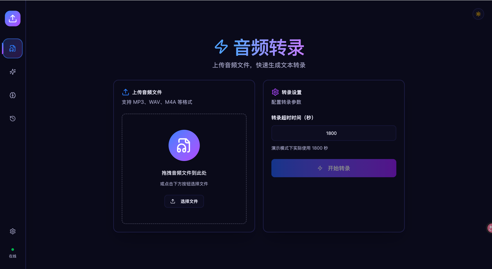
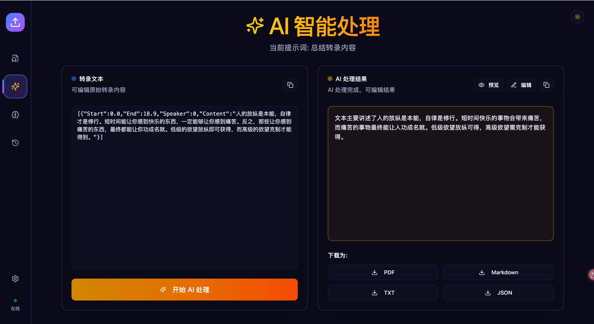
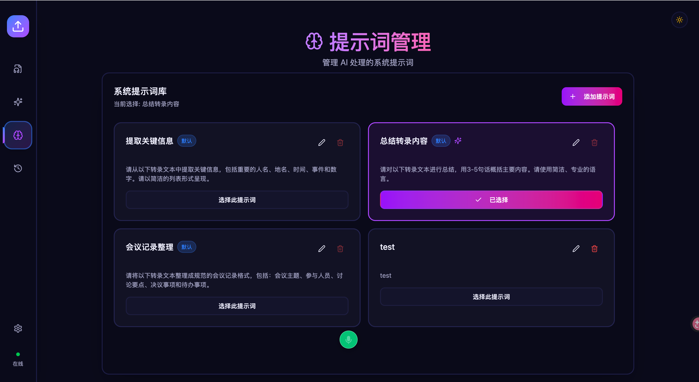
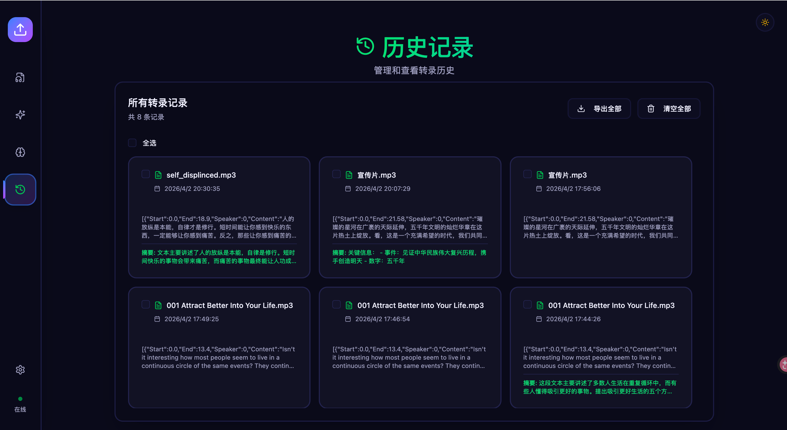

# VibeVoice ASR Client/Server

A client-server architecture for VibeVoice-ASR-4bit speech recognition, optimized for Apple Silicon (MLX).

The server loads the model once and keeps it in memory, enabling fast repeated transcription requests.

## Features

- **Server-client architecture**: Model loaded once, serve many requests
- **Automatic audio format detection**: Handles WAV, MP3, M4A, OGG, FLAC regardless of file extension
- **Multiple output formats**: JSON, TXT, SRT, VTT
- **Progress tracking**: Real-time transcription progress on server side
- **Timing information**: Returns text length, audio duration, and processing time

## Environment Setup

```bash
# Create conda environment
conda create -n vibevoice-asr python=3.12
conda activate vibevoice-asr

# Install dependencies
pip install -r requirements.txt
```

## Model Setup

### Download Model

```bash
# Create model directory
mkdir -p /Users/zephyrmuse/LLMs/model_weights/VibeVoice-ASR-4bit

# Download model from ModelScope
modelscope download --model mlx-community/VibeVoice-ASR-4bit --local_dir /Users/zephyrmuse/LLMs/model_weights/VibeVoice-ASR-4bit
```

### Model Path

By default, the server looks for the model at:
```
/Users/zephyrmuse/LLMs/model_weights/VibeVoice-ASR-4bit
```

You can override this with the environment variable:
```bash
export VIBEVOICE_MODEL_PATH=/path/to/your/model
```

## Server

### Start Server

```bash
python server.py
```

The server will:
1. Load the MLX model
2. Listen on `http://0.0.0.0:8765`
3. Print real-time transcription progress

### Server Options

| Option | Description |
|--------|-------------|
| `VIBEVOICE_MODEL_PATH` | Path to the model directory (default: see above) |
| `PORT` | Server port (default: 8765) |

### Health Check

```bash
curl http://localhost:8765/health
# Returns: OK
```

## Client

### Basic Usage

```bash
python client.py <audio_file>
```

### Options

| Short | Long | Default | Description |
|-------|------|---------|-------------|
| `-s` | `--server` | `http://localhost:8765` | Server URL |
| `-f` | `--format` | `json` | Output format: `txt`, `json`, `srt`, `vtt` |
| `-o` | `--output` | (stdout) | Output file path |
| `-t` | `--timeout` | `3600` | Request timeout in seconds |
| | `--raw` | | Output raw response without formatting |

### Examples

```bash
# Basic transcription (default: JSON format with timestamps)
python client.py audio.wav

# Plain text output
python client.py audio.wav -f txt

# Save to file
python client.py audio.wav -o result.txt

# Combine options
python client.py audio.wav -f txt -o result.txt -t 7200

# Raw JSON output
python client.py audio.wav --raw
```

### Output Format

**JSON format (default):**
```
[00:00.000 - 00:18.900] Speaker 0: 人的放纵是本能，自律才是修行。...

[Info] Text: 142 chars | Audio: 18.90s | Processing: 5.75s
```

**TXT format:**
```
人的放纵是本能，自律才是修行。短时间能让你感到快乐的东西...

[Info] Text: 142 chars | Audio: 18.90s | Processing: 5.75s
```

## Audio Format Support

The server automatically detects audio format from file headers, not file extensions:

| Format | Header | Extension |
|--------|--------|-----------|
| WAV | `RIFF....WAVE` | .wav |
| MP3 | `ID3...` or `0xFF` | .mp3, .wav (misnamed) |
| M4A | `....` (MP4) | .m4a |
| OGG | `OggS` | .ogg |
| FLAC | `fLaC` | .flac |

## Project Structure

```
.
├── client.py          # Client script
├── server.py          # Server script
├── requirements.txt   # Python dependencies
├── frontend/          # React frontend
│   ├── src/
│   │   ├── components/   # React components
│   │   ├── services/     # API services
│   │   └── app/           # Main application
│   ├── package.json
│   └── vite.config.ts
├── ai_agent/          # AI Agent service
│   ├── ai_agent_server.py  # FastAPI server
│   ├── llm_engine.py    # Streaming agent logic
│   └── requirements.txt # AI Agent dependencies
├── LICENSE            # MIT License
├── README.md          # This file
├── README_zh.md       # Chinese documentation
└── examples/         # Example audio files
```

## Frontend (React SPA)

A modern web interface is included in the `frontend/` directory.

### Features

- **Drag & drop audio upload**: Support for WAV, MP3, M4A, OGG, FLAC
- **Real-time transcription**: Visual progress tracking
- **AI processing**: Process transcriptions with customizable system prompts
- **Markdown preview**: AI results rendered with Markdown for better readability
- **Dark/Light mode**: Theme toggle support
- **Multiple export formats**: PDF, Markdown, TXT, JSON
- **History management**: Browse, select and export past transcriptions
- **Configurable AI models**: Support for Doubao, Qwen, and DeepSeek

### Screenshots

**Audio Transcription**


**AI Processing**


**Prompt Management**


**History**


### Setup

```bash
cd frontend
npm install
npm run dev
```

The frontend development server runs on `http://localhost:5173` and connects to the backend at `http://localhost:8765`.

### Tech Stack

- React 18 + TypeScript
- Vite build tool
- TailwindCSS
- Radix UI components
- jsPDF for PDF export

## AI Agent Service

The `ai_agent/` directory contains a FastAPI service that provides AI-powered text processing using customizable system prompts.

### Setup

```bash
cd ai_agent
pip install -r requirements.txt
```

### Start AI Agent Server

```bash
python ai_agent_server.py
```

The AI Agent server runs on `http://localhost:8766`.

### API Endpoints

| Endpoint | Method | Description |
|----------|--------|-------------|
| `/health` | GET | Health check |
| `/ai-process` | POST | Process transcription with prompt |

### Request Format

```json
{
  "transcription": "transcribed text...",
  "prompt": "system prompt content...",
  "session_id": "optional_session_id"
}
```

### Architecture

```
Frontend (5173) → AI Agent Server (8766) → LLM (DeepSeek/Volcengine)
```

## License

MIT License - see [LICENSE](LICENSE)
